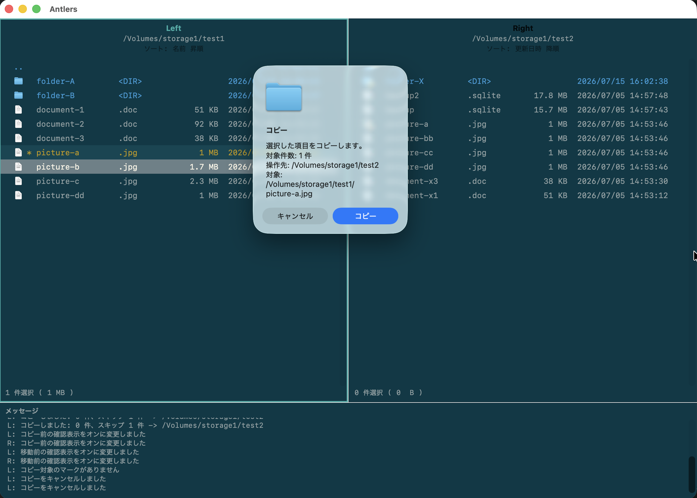

# File operations

When items are marked, actions apply to the marked items; otherwise they apply to the selected item. The destination is normally the current directory in the opposite pane.

| Key | Action |
| --- | --- |
| `C` | Copy to the opposite pane |
| `M` | Move to the opposite pane |
| `D` | Move to Trash |
| `R` | Rename the selected item |
| `Shift+R` | Copy with a new name in the same directory |
| `K` | Create a folder in the current directory |
| `P, 1` | Copy file names to the clipboard |
| `P, 2` | Copy parent directory paths to the clipboard |
| `P, 3` | Copy full paths to the clipboard |
| `_` / `Shift+_` | Show the context menu |

## Confirm before copying

Before copying, you can review the item count, destination, and source paths. Select **Copy** only after checking the details, or choose **Cancel** to stop.

Potential overwrites require explicit confirmation. Deleting moves items to Trash rather than permanently deleting them. See [Safe operations](safety.md).

## Clipboard and context menu

Use `P, 1`, `P, 2`, and `P, 3` to copy file names, parent directory paths, or full paths as multi-line text. Targets follow the same rule as file operations: marked items when present, otherwise the selected item.

Use `_` or `Shift+_` to show the context menu. The menu provides Open, Open With, Reveal in Finder, Copy Path, Copy, Move, Rename, Copy with New Name, and Create Folder.

## Drag files to other applications

Enable **Allow file drag to other applications** in General settings to drag files from a file list into another application. The drag provides copied file URLs and never moves items within Antlers.

Starting a drag from a marked item includes all marked items. Starting from an unmarked item includes only that item.
