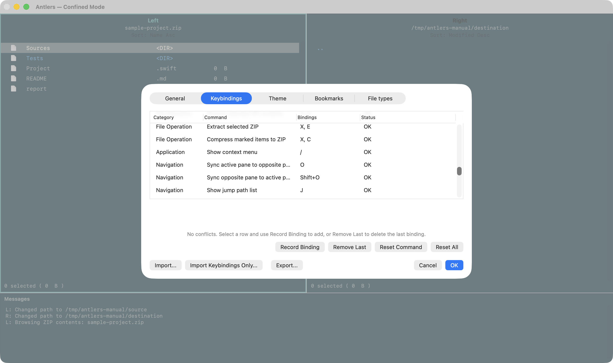

# Keybindings

Press `Z` or `Command+,`, then open **Keybindings** to review and change shortcuts. A command can have multiple key sequences, including multi-stroke sequences such as `S, F`.

Search the list by command name, keyword, or displayed key. **Search by key** lets you enter a sequence and inspect its assignment. Reassign or remove an assigned sequence, or choose a command for an available sequence. Press `Esc` to leave key capture. Selecting a command shows its assigned sequences below, where each can be removed. Click OK in Settings to save changes.

## Frequently used keys

| Key | Action |
| --- | --- |
| `Tab` | Switch the active pane |
| `Space` | Mark an item |
| `C` / `M` / `D` | Copy / move / move to Trash |
| `F` | Start incremental search |
| `V` | Preview the selected file |
| `Shift+V` / `Option+V` | Show or hide the auxiliary preview pane / enter preview mode |
| `Shift+@` / `Shift+:` | Wildcard marking / file mask |
| `L` | Show Locations (`Command+E` ejects a removable selected volume) |
| `T` / `Shift+T` | Show tags / add or remove a tag on the selected item |
| `Control+Return` | Open with the configured application |
| `P, 1` / `P, 2` / `P, 3` | Copy file names / parent directory paths / full paths |
| `X, O` / `X, E` / `X, C` | Browse ZIP / extract ZIP / compress marked items to ZIP |
| `/` | Show the operation menu |
| `Shift+?` / `Command+Shift+P` | Show the command palette |
| `S, S` / `S, E` / `S, F` / `S, T` | Sort by size / extension / name / modification date |
| `Shift+Control+Space` | Mark the range from the previous mark to the cursor |
| `Command+Shift++` / `Command+-` / `Command+0` | Increase / decrease / reset file-list font size |

Identical or prefix-overlapping sequences conflict. Resolve conflicts before applying the settings. After entering the first stroke of a multi-stroke sequence, Antlers can show available next keys and command candidates.

Unmodified `Return` is not a regular keybinding. It is controlled by the General "Return key behavior" setting. Function keys can be recorded and assigned like normal key sequences.

## Command palette

Open with `Shift+?` or `Command+Shift+P`, the `?` title-bar button, or the Help menu. Search by command name, keyword, or key. Select with Up/Down and run with `Return`; press `Esc` to close. Unavailable commands show a reason. **Open Keybindings** takes you to the selected command's shortcut settings. With an empty search, recently used commands appear first.
