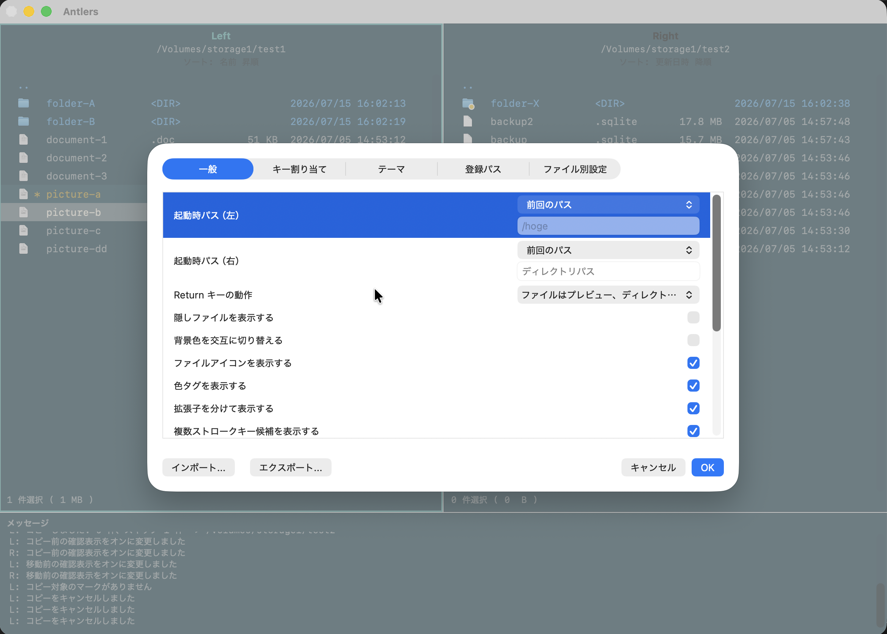

# Settings and appearance

Press `Z` or `Command+,` to open Settings. You can change startup locations, action confirmations, file-list appearance, themes, and keybindings.

## Built-in themes

Choose from Light, Dark, Dracula, Nord, Solarized Light, and Solarized Dark. Switch the file-list background, text colors, and accent colors to suit your environment.

| Light | Dark |
| --- | --- |
|  |  |
| Dracula | Nord |
|  |  |
| Solarized Light | Solarized Dark |
|  |  |

## Custom themes

You can also adjust display colors to create your own theme, including colors for the selected row, marked rows, and message area.

## Zebra rows

Enable alternating row backgrounds to make long file lists easier to scan.

Next: [Keybindings](keybindings.md)
