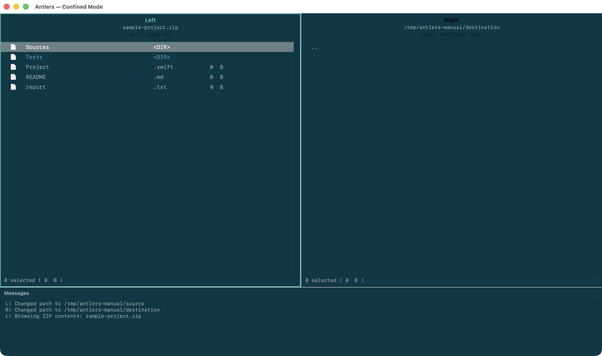
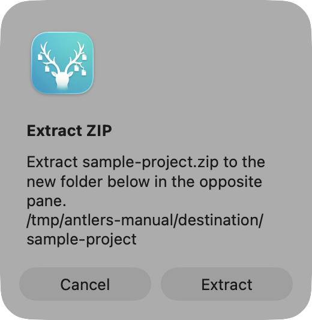
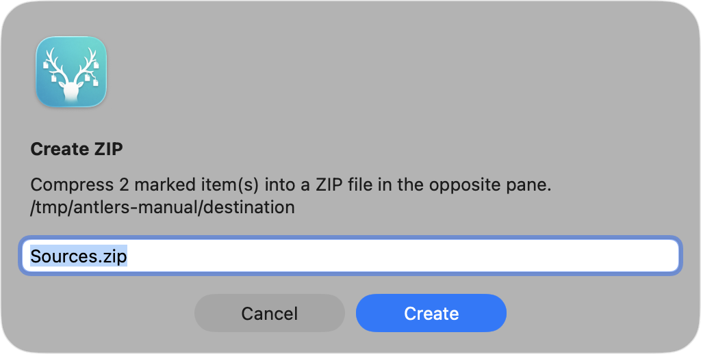

# ZIP／アーカイブ操作

v0.6.0では、ZIPファイルの内容を閲覧したり、展開・作成したりできます。操作対象は通常のファイル操作と同じく、マーク済み項目があればそれら、なければ選択中の項目です。

## ZIPの内容を閲覧する

ZIPファイルを選択して `X, O` を押すと、内容をペイン内に表示します。Generalの「ZIP ファイルをディレクトリとして扱う」が有効なら、修飾キーなしの `Enter` でも同じ操作ができます。

ZIP内ではディレクトリを開けます。`Backspace` でZIP内の親階層へ戻り、ルートでさらに `Backspace` を押すと通常のファイル一覧へ戻ります。

ZIP内の項目は仮想項目です。通常のコピー、移動、リネーム、ゴミ箱移動などの対象にはできません。

## ZIPを展開する

ZIPファイルを選択して `X, E` を押します。展開先は逆側のペインの現在位置に、ZIPファイル名から拡張子を除いた新しいフォルダとして提案されます。確認画面で内容を確認してから **展開** を選んでください。

既存のフォルダやファイルがある場合は上書きせず、展開に失敗した場合も途中の出力を確定しません。

## ZIPを作成する

項目をマークして `X, C` を押すと、マーク済み項目を逆側のペインの現在位置へZIPとして圧縮します。ZIPファイル名を入力し、**作成** を選んでください。ファイル名に `.zip` がなければ自動的に付加されます。

## 操作上の制限

- ZIPの閲覧中は、閲覧中のペインを通常の操作先として使用できません。
- ZIPの展開先となる逆側のペインがZIP閲覧中の場合、展開・作成は実行できません。
- 絶対パスや `..` を含む危険なアーカイブ内パスは拒否します。
- symlinkを含むZIPは扱いません。
- 展開サイズまたは項目数が安全上の上限を超えるZIPは拒否します。

詳細は [安全な操作](safety.md) を参照してください。

[ファイル操作へ戻る](file-operations.md)
