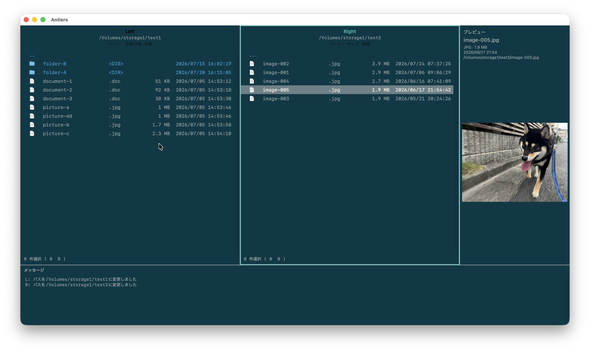

# Antlers マニュアル

Antlers は、キーボードで素早く操作できる macOS 用の左右 2 ペイン型ファイラーです。左右のペインをコピー元とコピー先として見比べながら、ファイルを整理できます。必要に応じて補助プレビューペインも表示できます。

## はじめに

- [導入と初回起動](getting-started.md)
- [基本操作](basic-operations.md)

## ファイルを扱う

- [ファイル操作](file-operations.md)
- [安全な操作](safety.md)

## 自分好みに設定する

- [設定と外観](settings.md)
- [キーバインド](keybindings.md)

## リリースノート

- [V0.5.0](releases/v0.5.0.md)
- [V0.4.0](releases/v0.4.0.md)
- [V0.3.0](releases/v0.3.0.md)
- [V0.2.0](releases/v0.2.0.md)

[English manual](../en/)
