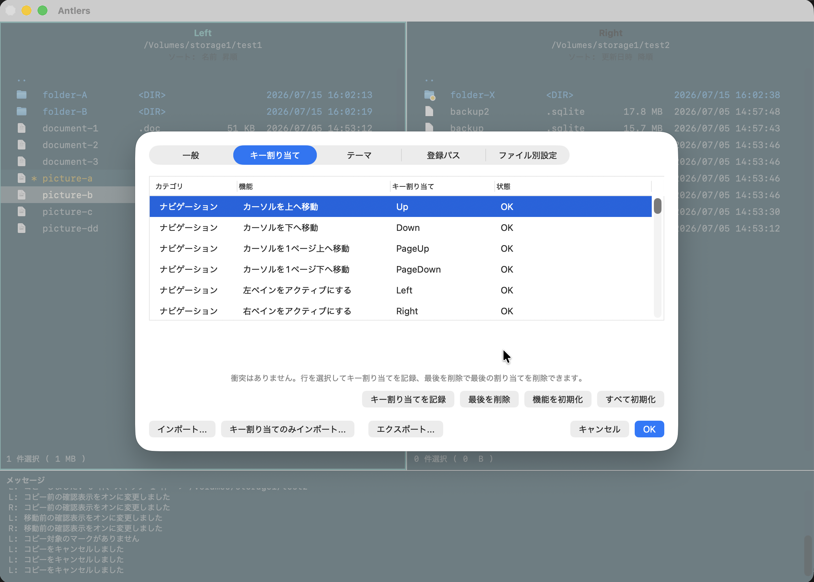

# キーバインド

`Z` または `Command+,` で設定を開き、**Keybindings** からキー操作を確認・変更できます。1つのコマンドには複数のキー列を割り当てられ、`S, F` のような複数ストロークの操作にも対応します。

## よく使うキー

| キー | 操作 |
| --- | --- |
| `Tab` | アクティブペインを切り替える |
| `Space` | 項目をマークする |
| `C` / `M` / `D` | コピー / 移動 / ゴミ箱へ移動 |
| `F` | インクリメンタルサーチ |
| `V` | 選択中ファイルをプレビュー |
| `Shift+V` / `Option+V` | 補助プレビューペインを表示・非表示 / プレビューモードに入る |
| `Shift+@` / `Shift+:` | ワイルドカードマーク / ファイルマスク |
| `L` | 場所一覧を表示（取り外し可能なボリュームは `Command+E` で取り外し） |
| `T` / `Shift+T` | タグ一覧を表示 / 選択項目のタグを設定・解除 |
| `Control+Return` | 指定アプリで開く |
| `P, 1` / `P, 2` / `P, 3` | ファイル名 / 親ディレクトリのパス / フルパスをコピー |
| `_` / `Shift+_` | コンテキストメニューを表示 |
| `S, S` / `S, E` / `S, F` / `S, T` | サイズ / 拡張子 / 名前 / 更新日時でソート |
| `Command+Shift++` / `Command+-` / `Command+0` | 一覧フォントを拡大 / 縮小 / 標準サイズへ戻す |

キー列が他の操作と重複したり、前方一致したりする場合は衝突として扱われます。衝突を解消してから設定を適用してください。

複数ストロークの1打目を入力すると、続けて入力できるキーとコマンドの候補を表示できます。

修飾キーなしの `Return` は通常のキーバインドではなく、General の「Return キーの動作」設定で扱います。ファンクションキーは、キーバインド記録画面から通常のキー列として割り当てられます。
