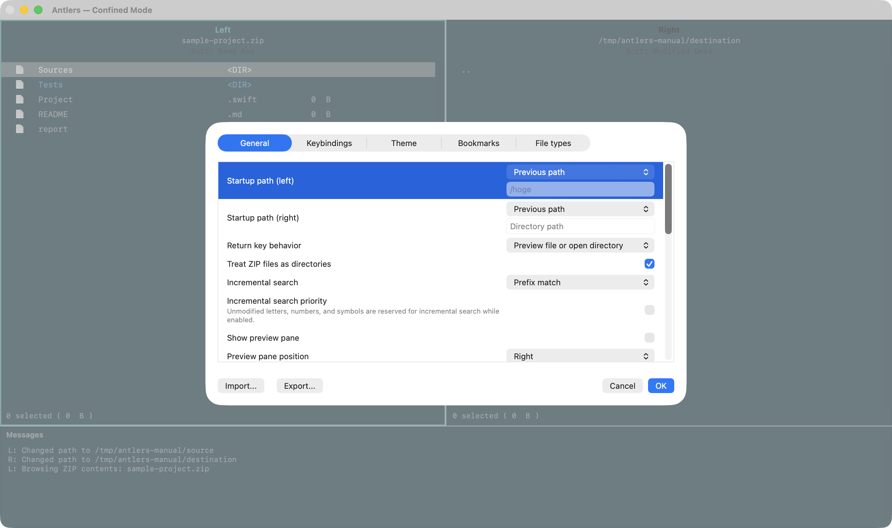
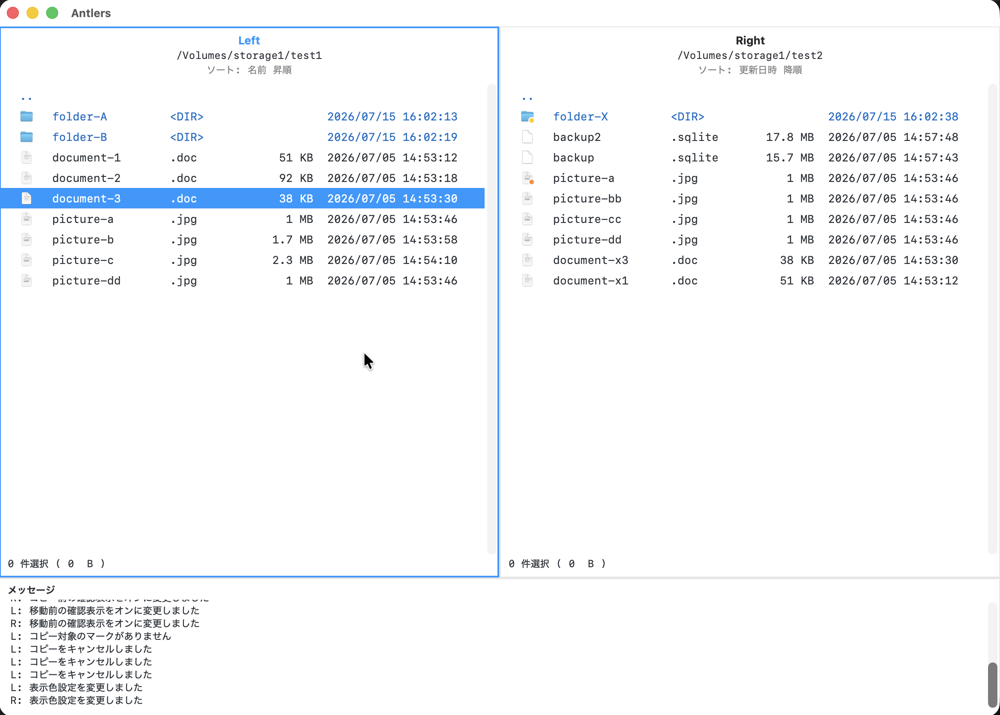
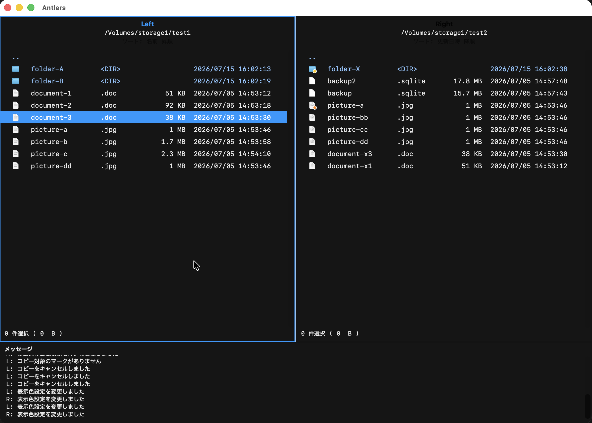
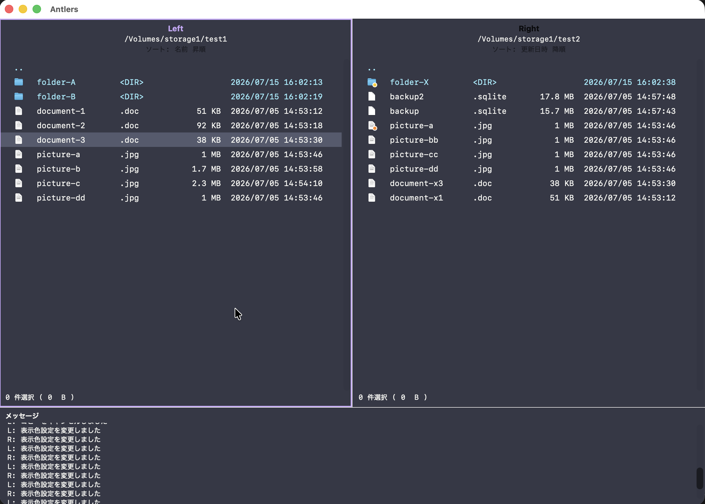
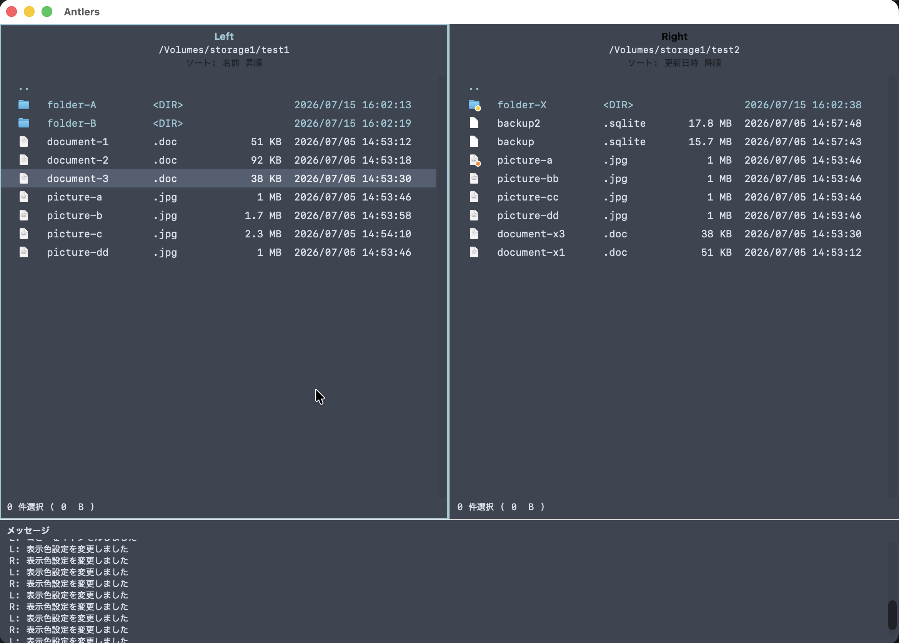
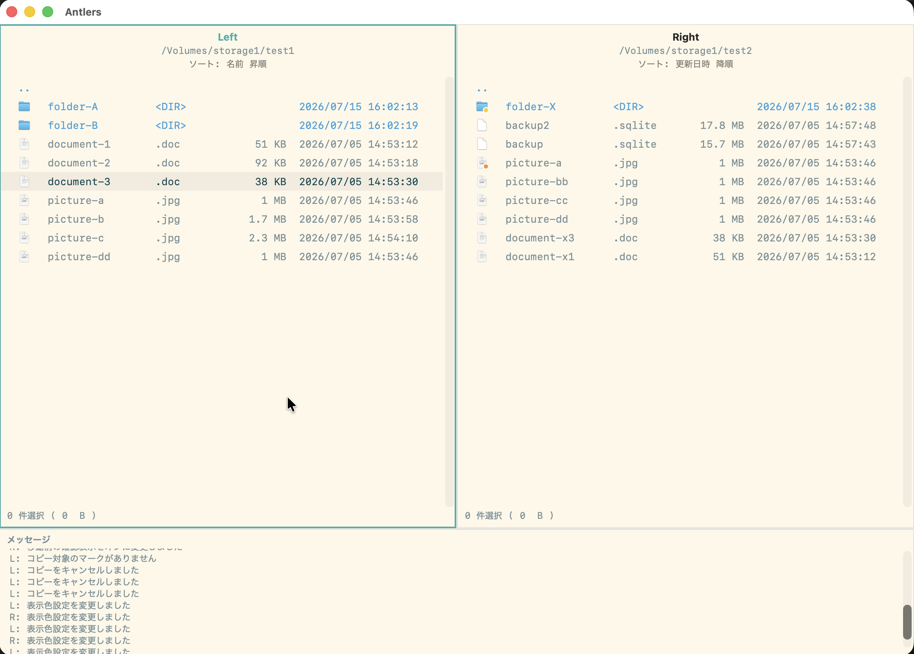
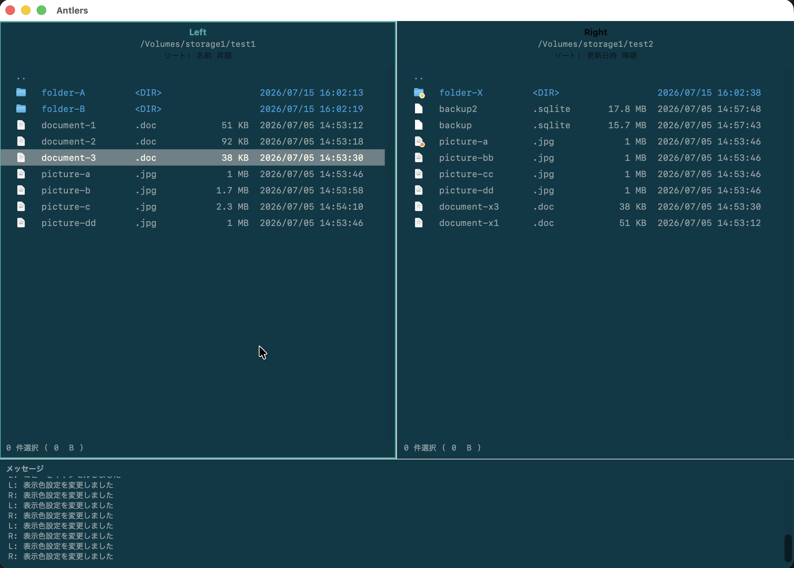
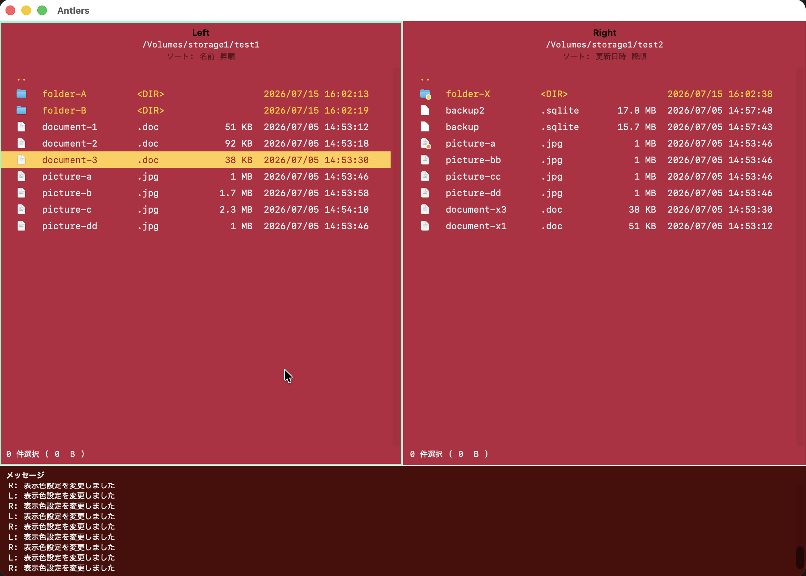
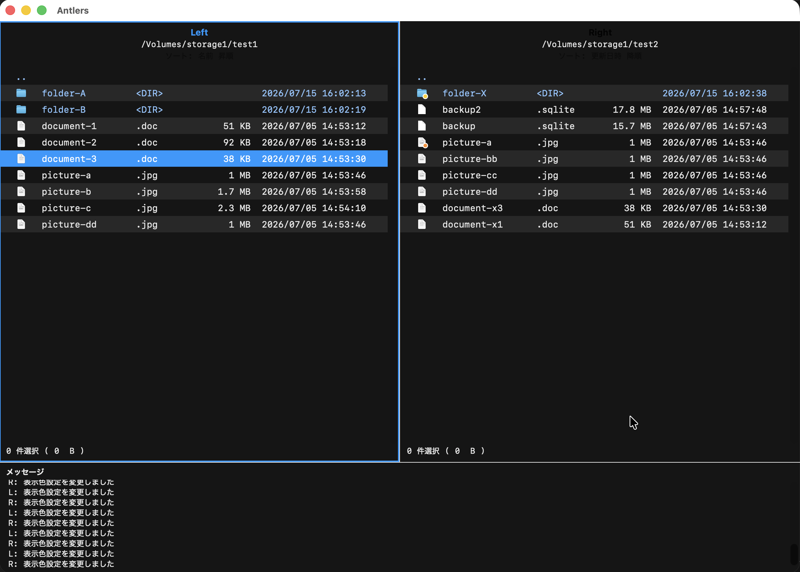

# 設定と外観

`Z` または `Command+,` で設定ウィンドウを開きます。ここでは起動時の場所、操作前の確認、ファイル一覧の表示、テーマ、キーバインドなどを変更できます。

## General

General では、アプリの表示言語、Return キーの動作、インクリメンタルサーチの照合方法、起動時の左右ペインの場所を設定できます。ファイル一覧のフォントサイズは 8〜24 pt の範囲で変更できます。

Return キーの動作は、メインペインの修飾キーなし `Return` だけに適用されます。既定では選択中ディレクトリへ移動しますが、ファイルをプレビューしてディレクトリは移動する、または何もしない動作にも変更できます。

インクリメンタルサーチは、前方一致、部分一致、完全一致から選べます。

「インクリメンタルサーチ優先」を有効にすると、修飾キーなしの英数字・記号キーがインクリメンタルサーチに優先して使用されます。通常のキーバインドとして使いたい場合は無効にしてください。既定値はオフです。

「ZIP ファイルをディレクトリとして扱う」を有効にすると、ZIPファイルを `Enter` でペイン内から閲覧できます。無効にすると、ZIPは通常のファイルとして扱われます。既定値はオンです。

「プレビューペインを表示する」を有効にすると、選択項目に追従する補助プレビューを表示します。「プレビューペインの位置」で左または右を選べます。幅をドラッグまたはプレビューモードで変更した場合、その幅は次回起動時にも復元されます。

## 操作と確認

コピー、移動、ゴミ箱への移動、終了前の確認を個別に切り替えられます。ファイル操作の明細ログ表示件数も設定できます。`0` を指定すると全件を表示します。

マーク後にカーソルを移動する、作成したフォルダへ移動する、親ディレクトリへ戻った後に元のディレクトリを選択する、といった操作挙動も設定できます。

「他のアプリケーションへのファイルドラッグを許可する」は既定でオフです。有効にすると、一覧から他のアプリケーションへファイルをコピーとしてドラッグできます。

## 設定のインポートとエクスポート

設定ウィンドウ下部の「インポート…」と「エクスポート…」で、JSON 形式の設定ファイルを読み書きできます。インポートした内容は、設定ウィンドウで OK を押すまで反映されません。Cancel または `Esc` を押すと破棄されます。

キー割り当てだけ、またはカスタムテーマだけをインポートすることもできます。壊れたファイルや未対応の設定値は読み込まず、既存の設定は変更しません。

## 組み込みテーマ

Light、Dark、Dracula、Nord、Solarized Light、Solarized Dark の組み込みテーマを選べます。作業環境や好みに合わせて、一覧の背景色・文字色・強調色を切り替えられます。

| Light | Dark |
| --- | --- |
|  |  |
| Dracula | Nord |
|  |  |
| Solarized Light | Solarized Dark |
|  |  |

## カスタムテーマ

組み込みテーマを起点にせず、表示色を自分の好みに合わせて調整することもできます。選択行、マーク済み行、メッセージ領域などを区別しやすい配色にできます。

## ファイル別設定

拡張子ごとに、指定アプリと一覧表示色を設定できます。指定アプリを登録したファイルは、既定の `Control+Return` でそのアプリケーションから開けます。

「その他」は、具体的な拡張子が設定されていない通常ファイルに適用します。拡張子なしのファイルも対象ですが、ディレクトリと特殊項目には適用しません。具体的な拡張子の設定は「その他」より優先します。

## ゼブラ表示

「背景色を交互に切り替える」を有効にすると、ファイル一覧の行の背景色が交互に変わります。横に長い一覧で行を追いやすくしたい場合に便利です。

次へ: [キーバインド](keybindings.md)
